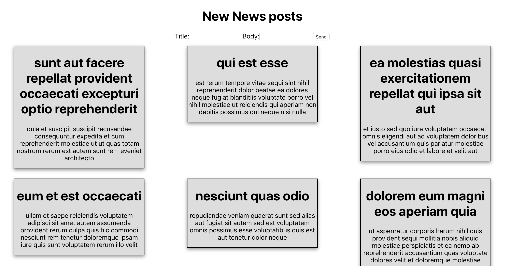

#  Axios with React

## Running this:

This project was created with [`create-react-app`](https://facebook.github.io/create-react-app/docs/getting-started). Once you have the app cloned, you should run `npm install`. You can then run it with `npm start`.

### Big Goal:

Create a react app that render Posts form external API. Through this code along we will cover the best place can call an API inside Component live circle.

### Final result: 

